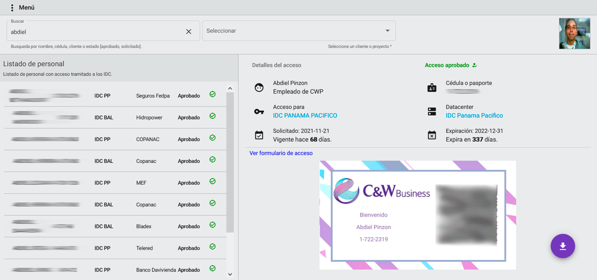
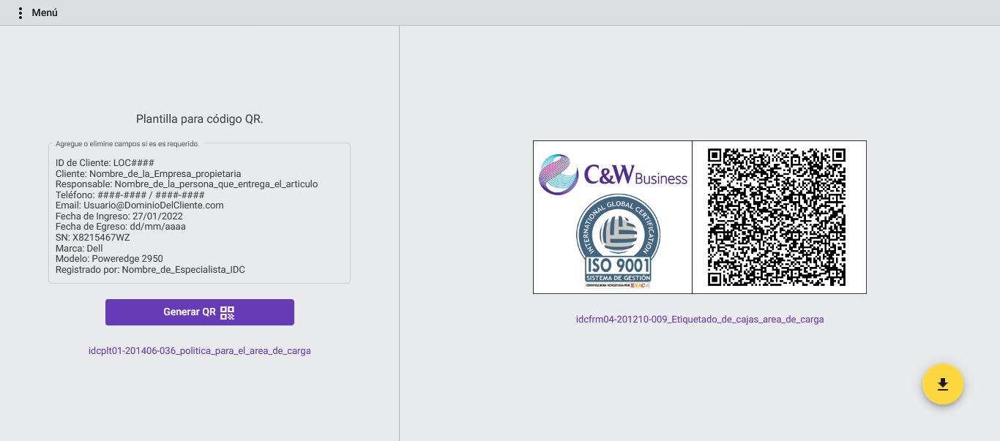

# Qrcodes Application

## Table of contents

- [Overview](#overview)
  - [Screenshot](#screenshot)
- [My process](#my-process)
  - [Built with](#built-with)
- [Author](#author)

## Overview

An useful app than generate QR codes. It has an API than serve data from a MySQL database.

It's make the register and access process to a datacenter easier. It also have a section to generate QR codes for tagging cargo.

### Screenshot

 

## My process

### Built with

- Semantic HTML5 markup
- CSS custom properties
- Angular - JS library
- Angular Material
- CSS Grid
- Flexbox
- NodeJS

## Author

- Portfolio: - [Portfolio](https://abdielp.github.io/webdeveloper-portfolio/index.html)
- GitHub - [@AbdielP](https://github.com/AbdielP)
- Twitter - [@abdiel262](https://twitter.com/Abdiel262)
- Linkedin - [@abdielpinzoncarrera](https://www.linkedin.com/in/abdielpinzoncarrera/)
